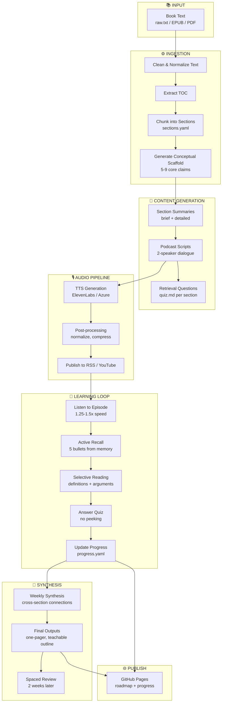
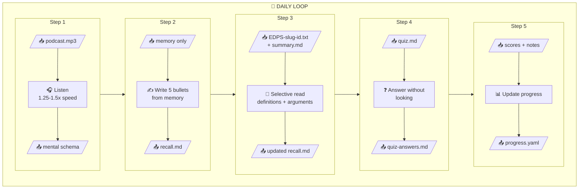
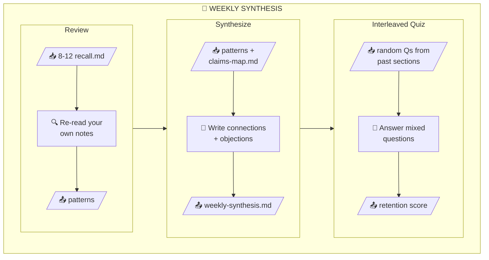
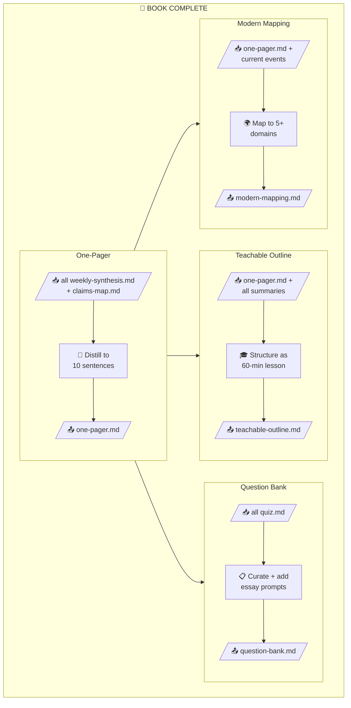
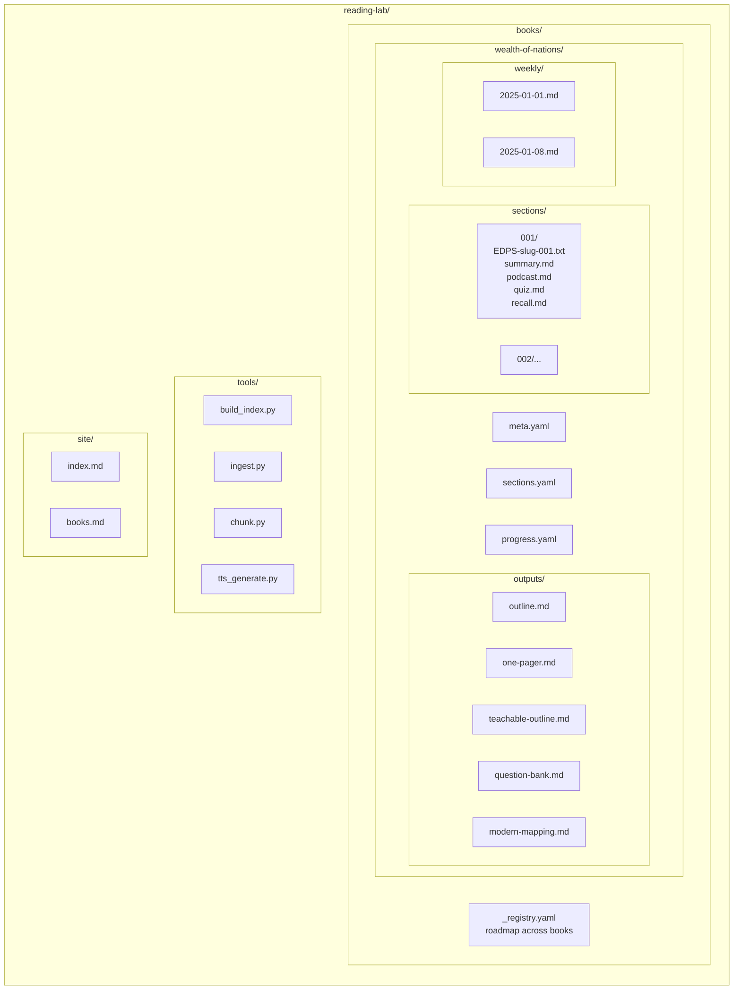
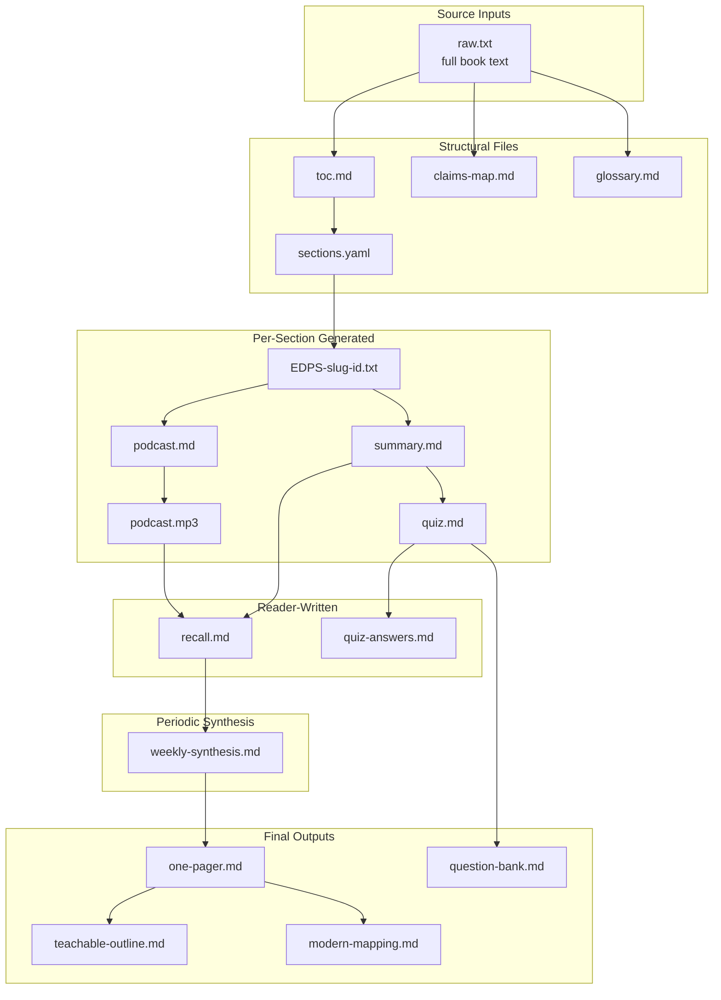
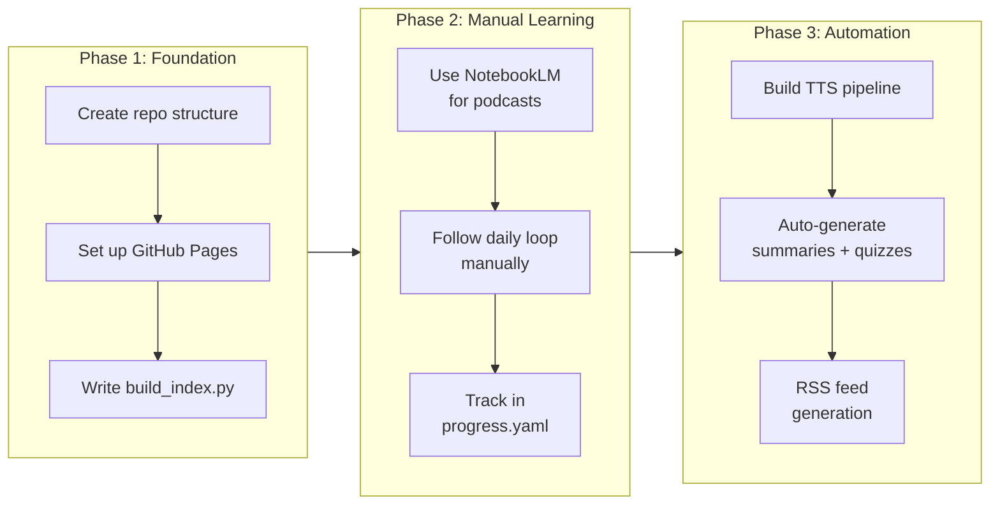

# EDPS Method-Implementation

> A research-backed system for extracting lasting knowledge from important works.

---

## Table of Contents

1. [The Problem](#the-problem)
2. [What We're Solving](#what-were-solving)
3. [The Science Behind the Method](#the-science-behind-the-method)
4. [Design Principles](#design-principles)
5. [System Overview](#system-overview)
6. [The Workflow](#the-workflow)
7. [Resource Definitions](#resource-definitions)
8. [Detailed Resource Specifications](#detailed-resource-specifications)
9. [Repository Structure](#repository-structure)
10. [Build Priority](#build-priority)
11. [References](#references)

---

## The Problem

You decide to read an important book—*The Wealth of Nations*, *Capital*, *The Intelligent Investor*. You know it matters. You start reading.

Then one of these happens:

1. **You stall in slow sections.** Dense 18th-century prose. Long historical examples. Your motivation drops.

2. **You finish but retain little.** Weeks later, you can't articulate the core argument. The book becomes a vague memory: "something about division of labor."

3. **You take notes but never use them.** Highlights pile up. You never return to them. The effort feels wasted.

4. **You can't connect it to today.** The ideas feel historically interesting but practically inert. You can't explain why they matter now.

This isn't a failure of willpower. It's a failure of *method*.

Most people read books the way they were taught in school: start at page one, read linearly, maybe highlight, maybe take notes. This approach works for novels. It fails catastrophically for dense intellectual works where the goal is *lasting understanding*, not completion.

The research is clear: **passive reading produces familiarity, not memory.** You recognize ideas when you see them again, but you can't retrieve them on demand. You feel like you "know" the material, but you can't use it.

---

## What We're Solving

This system solves the problem of **reading without retaining**.

Specifically, we're building a workflow that:

| Goal | How We Achieve It |
|------|-------------------|
| **Never feel lost** | Generate a conceptual scaffold (5-9 core claims) before reading, so you always know why a section exists |
| **Stay motivated** | Use audio-first exposure (podcasts) to build mental hooks before tackling dense text |
| **Retain long-term** | Force active recall and spaced repetition—the two highest-ROI learning techniques |
| **Connect to today** | Require explicit modern application in every summary and final output |
| **Produce usable knowledge** | End with concrete artifacts: one-pagers, teaching outlines, question banks |
| **Track progress visibly** | Publish a public roadmap so you can see (and share) your intellectual journey |

The system uses AI to handle *preparation work* (summaries, podcast scripts, quizzes) so you can focus on *learning work* (recall, synthesis, application). AI is the sous chef; you are the chef.

---

## The Science Behind the Method

This workflow is grounded in cognitive psychology research. Below are the key findings that shaped our design, with citations you can verify.

### 1. Active Recall Beats Passive Review

**Finding:** Actively trying to retrieve information from memory produces stronger long-term retention than rereading or passive review.

**Research:**
- Dunlosky et al. (2013) reviewed decades of learning research and concluded that *retrieval practice* (testing yourself) is one of the most effective learning techniques. [Dunlosky, J., et al. "Improving students' learning with effective learning techniques." Psychological Science in the Public Interest, 14(1), 4-58.]
- Studies show improved academic performance and better self-efficacy when active recall strategies are used. [[ScienceDirect](https://www.sciencedirect.com/science/article/pii/S0165032724004245)]

**How we use it:**
- After listening to a podcast episode, you write `recall.md` from memory *before* looking at the source
- Quiz questions force retrieval, not recognition
- Weekly synthesis requires reconstructing connections without notes

---

### 2. Spaced Repetition Beats Massed Study

**Finding:** Spreading study sessions across time leads to much better long-term retention than cramming. This is called the *spacing effect*.

**Research:**
- Hermann Ebbinghaus first documented the spacing effect in the 1880s. It remains one of the most robust and replicated findings in psychology. [[Wikipedia: Spacing Effect](https://en.wikipedia.org/wiki/Spacing_effect)]
- Modern research confirms that distributing retrieval practice over increasing intervals enhances consolidation into long-term memory. [[ScienceDirect](https://www.sciencedirect.com/science/article/abs/pii/S0196070922001223)]
- The Leitner system (flashcard scheduling with increasing intervals) is a practical implementation of this principle. [[Wikipedia: Leitner System](https://en.wikipedia.org/wiki/Leitner_system)]

**How we use it:**
- Daily loop: one new section + one review quiz from an older section
- Weekly synthesis: revisit 8-12 sections and write cross-connections
- Spaced review: return to your one-pager two weeks after completing a book

---

### 3. Active Recall + Spacing = Optimal Retention

**Finding:** The combination of retrieval practice and spaced repetition produces superior long-term retention compared to either technique alone.

**Research:**
- Retrieval strengthens neural pathways via the act of recall
- Spacing ensures review happens at points where forgetting is likely, reinforcing memory just as it begins to decay
- Research and expert guides agree that combining these creates superior long-term retention. [[Kitzu](https://kitzu.org/active-recall-vs-spaced-repetition-which-study-technique-works-best/)]

**How we use it:**
- The daily loop combines recall (step 2) with quizzing (step 4)
- The weekly loop adds interleaved quizzes (questions from multiple past sections)
- Progress tracking reminds you which sections need review

---

### 4. Multimodal Learning Improves Comprehension

**Finding:** Learning using multiple representational formats (visual + verbal + auditory) creates multiple memory pathways, improving retention.

**Research:**
- *Dual coding theory* (Paivio, 1971) proposes that information encoded in both verbal and visual forms is easier to recall
- The *picture superiority effect* demonstrates that images are more memorable than text alone, and combining them yields better recall. [[Wikipedia: Picture Superiority Effect](https://en.wikipedia.org/wiki/Picture_superiority_effect)]
- Multimodal encoding (reading + listening + summarizing) boosts retention compared to single modality study. [[Kitzu](https://kitzu.org/scientifically-proven-study-techniques-to-enhance-learning-outcomes/)]

**How we use it:**
- **Listen first** (audio podcast) → **recall** (writing) → **read selectively** (text) → **quiz** (retrieval)
- Each pass has a *different cognitive goal*, preventing boredom and redundancy
- Podcast uses two speakers to create conversational variation

---

### 5. The Forgetting Curve Demands Intervention

**Finding:** Without active intervention (review or retrieval), memory decays rapidly. Most forgetting happens within the first 24-48 hours.

**Research:**
- Ebbinghaus's *forgetting curve* shows that retention drops to ~40% within days without review. [[Wikipedia: Forgetting Curve](https://en.wikipedia.org/wiki/Forgetting_curve)]
- Spaced repetition interrupts this decay at intervals that reinforce memory before it is lost

**How we use it:**
- Active recall happens *immediately* after listening (same day)
- Quizzes reinforce within the same session
- Weekly synthesis catches material before it fades
- Two-week review after book completion cements long-term storage

---

### 6. Cognitive Load Must Be Managed

**Finding:** Motivation drops when cognitive load exceeds perceived progress. Early "big picture" exposure prevents this.

**Research:**
- Cognitive load theory (Sweller, 1988) shows that working memory has limited capacity
- Providing structural scaffolds before detailed learning reduces extraneous load
- Knowing *why* a section exists prevents the "lost in the weeds" feeling

**How we use it:**
- **Scaffold first**: Generate claims-map (5-9 core claims) before any reading
- **Podcast before text**: Audio creates mental hooks so details attach easily
- **Summary before source**: Read the structured summary before tackling dense original text
- **Progress tracking**: Visible completion percentages maintain motivation

---

### Summary: The Research-Backed Learning Stack

| Technique | Research Basis | Implementation |
|-----------|---------------|----------------|
| **Active Recall** | Dunlosky et al. (2013), retrieval practice literature | `recall.md`, quiz questions, weekly synthesis |
| **Spaced Repetition** | Ebbinghaus (1885), spacing effect research | Daily review, weekly interleaving, 2-week final review |
| **Multimodal Encoding** | Dual coding theory, picture superiority effect | Listen → Write → Read → Quiz cycle |
| **Cognitive Scaffolding** | Cognitive load theory | Claims map, TOC, section priorities before reading |
| **Elaborative Interrogation** | Dunlosky et al. (2013) | "Explain" questions, modern mapping, teaching outline |
| **Interleaving** | Rohrer & Taylor (2007) | Mixed questions from multiple sections in weekly quizzes |

---

## Design Principles

These principles guide every decision in the system:

### 1. AI Prepares, You Learn

AI handles the *preparation work*:
- Chunking text into sections
- Generating summaries and podcast scripts
- Creating quiz questions
- Drafting glossaries and claims maps

You do the *learning work*:
- Writing recall notes from memory
- Answering quizzes without peeking
- Synthesizing connections across sections
- Writing final one-pagers and modern mappings

**Why:** You retain what you actively produce, not what you passively consume. If AI wrote your one-pager, you'd remember nothing.

### 2. Structure Before Content

Before reading any section:
- You have a claims map (what the book argues)
- You have a TOC (how it's organized)
- You have section priorities (what to focus on)
- You have a podcast (audio preview of the argument)

**Why:** Getting lost kills motivation. Structure prevents getting lost.

### 3. Every Pass Has a Different Job

| Pass | Cognitive Job |
|------|---------------|
| Podcast | Build schema (what problem is this solving?) |
| Recall | Test memory (what do I actually remember?) |
| Selective reading | Fill gaps (what did I miss or misunderstand?) |
| Quiz | Reinforce retrieval (can I answer without notes?) |
| Weekly synthesis | Build connections (how do sections relate?) |

**Why:** Repeating the same activity produces diminishing returns. Different activities produce compounding returns.

### 4. Constraints Force Quality

- One-pager: exactly 10 sentences
- Summary: exactly 5 argument steps
- Quiz: exactly 8 questions (5 recall, 2 explain, 1 apply)
- Podcast: exactly 3 closing questions

**Why:** Constraints force prioritization. Without limits, everything feels equally important and nothing sticks.

### 5. Modern Application Is Mandatory

Every summary includes a "Modern Application" section. The final output includes `modern-mapping.md` with 5+ domains mapped to today.

**Why:** Knowledge that can't be applied is trivia. Forcing modern connections makes ideas actionable.

### 6. Progress Is Visible

- `progress.yaml` tracks completed sections and scores
- GitHub Pages publishes a public roadmap
- You can see your intellectual journey across books

**Why:** Visible progress maintains motivation. Invisible progress feels like running on a treadmill.

---

## System Overview



---

## The Workflow

### Phase 1: Ingestion (One-time per book)

**Input:** Raw book text (public domain txt, EPUB, or PDF)

**Process:**
1. Clean and normalize text (remove headers/footers, standardize formatting)
2. Extract table of contents
3. Chunk into sections (1,500-3,000 words each, aligned to headings)
4. Generate conceptual scaffold:
   - Claims map (5-9 "load-bearing" claims)
   - Glossary (20-40 key terms)
   - Section priorities (must / skim / optional)

**Output:** Structured book ready for learning

---

### Phase 2: Content Generation (One-time per section)

**Input:** Section source text + claims map

**Process:**
1. Generate section summary (TLDR, key terms, argument steps, modern application)
2. Generate podcast script (2-speaker dialogue, 8-12 minutes)
3. Generate quiz (5 recall + 2 explain + 1 apply questions)
4. Generate audio via TTS (optional, or use NotebookLM manually)

**Output:** Learning materials for one section

---

### Phase 3: Daily Learning Loop (Per section)



**Time estimate:** 30-45 minutes per section

| Step | Duration | What You Do |
|------|----------|-------------|
| Listen | 8-12 min | Play podcast at 1.25-1.5x while walking, commuting, etc. |
| Recall | 5 min | Write 5 bullets from memory (no peeking!) |
| Read | 10-20 min | Skim source for definitions, argument steps, key quotes |
| Quiz | 5-10 min | Answer 8 questions without looking at notes |
| Track | 2 min | Update progress.yaml with completion + scores |

---

### Phase 4: Weekly Synthesis (Every 8-12 sections)



**Time estimate:** 45-60 minutes

**Output:** `weekly-synthesis.md` containing:
- Top 3 claims learned this week
- How they connect
- One strong objection + your response
- One modern connection (specific, not vague)
- Gaps/questions for next week

---

### Phase 5: Book Completion



**Final outputs:**
- `one-pager.md` — The book in 10 sentences (you write this)
- `teachable-outline.md` — 60-minute lesson plan (AI drafts, you refine)
- `question-bank.md` — 25 short-answer + 5 essay prompts (AI curates)
- `modern-mapping.md` — 5+ domains mapped to today (you write this)

---

### Phase 6: Spaced Review (2 weeks later)

- Re-listen to your weekly synthesis notes (audio or read)
- Skim your one-pager
- Answer one question: *"If I had to teach this book in one hour, what would I emphasize?"*
- Update your one-pager if your thinking has evolved

---

## Resource Definitions

### Generator Legend

| Symbol | Meaning |
|--------|---------|
| 🤖 | **AI-generated** — Created by LLM from source text |
| 👤 | **Reader-written** — You write this yourself |
| 🔧 | **Tool-generated** — Created by script/automation |
| 🤖→👤 | **AI-drafted, Reader-refined** — AI creates first draft, you edit |

---

### Resources (per section)

| Resource           | File              | Generator | Purpose                                   | Requirements                                             |
| ------------------ | ----------------- | --------- | ----------------------------------------- | -------------------------------------------------------- |
| **Source Text**    | `EDPS-<slug>-<id>.txt` | 🔧   | Raw book text for this section            | 1,500-3,000 words, aligned to chapter/heading boundaries |
| **Summary**        | `summary.md`      | 🤖        | Structured breakdown of the section       | See spec below                                           |
| **Podcast Script** | `podcast.md`      | 🤖        | Two-speaker dialogue for audio generation | See spec below                                           |
| **Podcast Audio**  | `podcast.mp3`     | 🔧        | Listenable episode (TTS from script)      | 5-15 min, normalized to -16 LUFS                         |
| **Quiz**           | `quiz.md`         | 🤖        | Retrieval practice questions              | See spec below                                           |
| **Recall**         | `recall.md`       | 👤        | Your active recall output                 | See spec below                                           |
| **Quiz Answers**   | `quiz-answers.md` | 👤        | Your quiz responses + score               | Written after taking quiz                                |

### Resources (per book)

| Resource | File | Generator | Purpose | Requirements |
|----------|------|-----------|---------|--------------|
| **TOC** | `toc.md` | 🔧 | Table of contents extracted from source | Hierarchical chapter/section structure |
| **Claims Map** | `claims-map.md` | 🤖→👤 | Conceptual scaffold | 5-9 "load-bearing" claims; AI drafts, you refine |
| **Glossary** | `glossary.md` | 🤖→👤 | Key terms | 20-40 recurring terms; AI drafts definitions, you verify |
| **Sections Plan** | `sections.yaml` | 🤖→👤 | Section boundaries and priorities | AI proposes chunks, you adjust |
| **Weekly Synthesis** | `weekly-YYYY-MM-DD.md` | 👤 | Cross-section connections | You write every 8-12 sections |
| **One-Pager** | `one-pager.md` | 👤 | Final distillation | You write; this is the retention test |
| **Teachable Outline** | `teachable-outline.md` | 🤖→👤 | Teaching plan | AI drafts structure, you refine content |
| **Question Bank** | `question-bank.md` | 🤖 | Comprehensive assessment | Curated from all section quizzes + essay prompts |
| **Modern Mapping** | `modern-mapping.md` | 👤 | Contemporary relevance | You write; forces application thinking |

### Progress & Tracking

| Resource | File | Generator | Purpose |
|----------|------|-----------|---------|
| **Book Metadata** | `meta.yaml` | 👤 | Title, author, dates, status |
| **Progress** | `progress.yaml` | 👤 | Completed sections, scores, notes |
| **Registry** | `_registry.yaml` | 👤 | Roadmap across all books |

---

## Detailed Resource Specifications

### `summary.md` — Section Summary

```markdown
# Section [ID]: [Title]
Location: [Book X, Chapter Y]

## TLDR
[3 sentences maximum. What is the core claim?]

## Key Terms
- **Term 1**: definition
- **Term 2**: definition
- **Term 3**: definition
- **Term 4**: definition
- **Term 5**: definition

## Argument Structure
1. [First premise or observation]
2. [Second step in reasoning]
3. [Third step]
4. [Fourth step]
5. [Conclusion or implication]

## Modern Application
[3-5 sentences connecting this to today: policy, technology, markets, society]

## Source Pointers
- Key passage: [page/paragraph reference]
- Best example: [page/paragraph reference]
```

**Requirements:**
- TLDR must fit in 3 sentences
- Exactly 5 key terms
- Argument in exactly 5 numbered steps
- Modern application must reference something from the last 10 years

---

### `podcast.md` — Podcast Script

```markdown
# Episode [ID]: [Title]
Duration target: 8-12 minutes

## Speakers
- **Host**: Sets context, asks questions, summarizes
- **Analyst**: Explains arguments, gives examples, corrects misconceptions

## Script

**[HOST]**: [Opening hook - why this matters, 2-3 sentences]

**[ANALYST]**: [Core claim of this section, plain language]

**[HOST]**: [Clarifying question or "wait, explain X"]

**[ANALYST]**: [Deeper explanation with concrete example]

**[HOST]**: [Modern parallel - "so this is like..."]

**[ANALYST]**: [Confirm or correct the parallel]

**[HOST]**: [Potential objection or counterargument]

**[ANALYST]**: [Address the objection]

**[HOST]**: [Recap - "so the key takeaway is..."]

**[ANALYST]**: [Confirm + one additional nuance]

## Closing Questions (for listener reflection)
1. [Factual recall question]
2. [Conceptual understanding question]
3. [Application question]
```

**Requirements:**
- 8-15 speaker turns total
- Host asks questions, Analyst explains
- Include 1 concrete historical example from the text
- Include 1 modern parallel
- End with exactly 3 reflection questions
- Script should produce 8-12 minutes of audio when read naturally

---

### `quiz.md` — Retrieval Questions

```markdown
# Quiz: Section [ID]

## Recall Questions (answer from memory)
1. [What was the main claim of this section?]
2. [What mechanism or process did the author describe?]
3. [What example did the author use to illustrate the point?]
4. [Define: [key term from this section]]
5. [Define: [another key term]]

## Explain Questions (teach it back)
6. Explain [concept] as if teaching a smart 15-year-old.
7. What would happen if [condition from the argument] were false?

## Apply Question
8. How does [concept from section] relate to [modern phenomenon]?
```

**Requirements:**
- Questions 1-5: Direct recall, answerable in 1-2 sentences
- Questions 6-7: Require explanation, 3-5 sentences each
- Question 8: Requires synthesis with modern context
- All questions must be answerable from this section alone (no cross-section knowledge needed)

---

### `recall.md` — Active Recall Output (you write this)

```markdown
# Recall: Section [ID]
Date: [YYYY-MM-DD]
Time spent: [X minutes]

## From Memory (before re-reading)
1. [Main claim as I remember it]
2. [Key mechanism or process]
3. [Example I remember]
4. [Modern parallel that came to mind]
5. [Something I'm unsure about]

## After Selective Reading (corrections)
- Correction 1: [what I got wrong or missed]
- Correction 2: [additional nuance]

## Self-Score
- Recall accuracy: [0-5]
- Confidence: [low / medium / high]

## One Sentence I'd Tell Someone
[If I had 30 seconds to explain this section, I'd say...]
```

**Requirements:**
- Write the "From Memory" section BEFORE looking at source or summary
- Time-box to 5 minutes for initial recall
- Self-score honestly (0 = blank, 5 = near-perfect)
- "One Sentence" forces prioritization

---

### `weekly-synthesis.md` — Weekly Synthesis

```markdown
# Weekly Synthesis: [Date Range]
Sections covered: [001-012]

## Top 3 Claims This Week
1. [Strongest/most important claim]
2. [Second claim]
3. [Third claim]

## How They Connect
[3-5 sentences explaining how these claims relate to each other.
Are they building blocks? Tensions? Different facets of one idea?]

## One Strong Objection
[What's the best counterargument to what I learned this week?
2-3 sentences stating the objection fairly.]

## My Response to the Objection
[How would the author respond? How do I respond? 2-3 sentences.]

## Modern Connection
[One specific thing in today's world (policy, tech, news) that
this week's reading helps explain. 2-3 sentences.]

## Gaps / Questions for Next Week
- [Question I still have]
- [Concept I need to revisit]
```

**Requirements:**
- Written after every 8-12 sections
- Must include an objection (forces critical thinking)
- Modern connection must be specific (not "this applies to economics")
- Keep total length under 500 words

---

### `one-pager.md` — Final One-Pager

```markdown
# [Book Title]: One-Pager
Author: [Name]
Completed: [Date]

## The Book in 10 Sentences

1. [Sentence 1: What problem is the author solving?]
2. [Sentence 2: Core claim #1]
3. [Sentence 3: Core claim #2]
4. [Sentence 4: Core claim #3]
5. [Sentence 5: The key mechanism or process]
6. [Sentence 6: Most important example]
7. [Sentence 7: Main limitation or what the author gets wrong]
8. [Sentence 8: What this explains about today]
9. [Sentence 9: What this does NOT explain]
10. [Sentence 10: The one idea I'll remember in 10 years]
```

**Requirements:**
- Exactly 10 sentences
- Each sentence must contain a claim + implication (not just description)
- Sentence 7 must be critical (what's wrong or limited)
- Sentence 10 is the "compression test" — most important single idea
- Total length: 200-300 words max

---

### `teachable-outline.md` — 60-Minute Teaching Plan

```markdown
# Teaching [Book Title] in 60 Minutes

## Audience
[Who is this for? What do they already know?]

## Learning Objectives
By the end, students will be able to:
1. [Objective 1]
2. [Objective 2]
3. [Objective 3]

## Outline

### Segment 1: [Title] (10 min)
- Key point: [one sentence]
- Example 1: [from the book]
- Example 2: [modern parallel]
- Transition: [how this leads to next segment]

### Segment 2: [Title] (10 min)
[Same structure]

### Segment 3: [Title] (10 min)
[Same structure]

### Segment 4: [Title] (10 min)
[Same structure]

### Segment 5: [Title] (10 min)
[Same structure]

### Segment 6: Synthesis & Discussion (10 min)
- Recap the 5 key points
- Open questions for discussion
- "If you remember one thing..."

## Predicted Student Questions
1. [Question] → [Your answer]
2. [Question] → [Your answer]
3. [Question] → [Your answer]
4. [Question] → [Your answer]
5. [Question] → [Your answer]
```

**Requirements:**
- Exactly 6 segments, 10 minutes each
- Each segment has 2 examples (1 historical, 1 modern)
- 3 learning objectives (testable)
- 5 predicted questions with answers
- This should be usable as an actual lesson plan

---

### `question-bank.md` — Comprehensive Assessment

```markdown
# Question Bank: [Book Title]

## Short Answer (25 questions)
Answer each in 2-3 sentences.

1. [Question]
2. [Question]
...
25. [Question]

## Essay Prompts (5 questions)
Answer each in 500-800 words.

1. [Prompt requiring synthesis across multiple chapters]
2. [Prompt requiring comparison with another thinker/book]
3. [Prompt requiring application to a modern issue]
4. [Prompt requiring critical evaluation of the author's argument]
5. [Prompt requiring personal reflection: "How has this changed your thinking?"]
```

**Requirements:**
- 25 short-answer questions covering all major sections
- 5 essay prompts of different types (synthesis, comparison, application, critique, reflection)
- Questions should be answerable by someone who did the full learning loop
- Include answer key or rubric in a separate file if desired

---

### `modern-mapping.md` — Contemporary Relevance

```markdown
# Modern Mapping: [Book Title]

## Domain 1: [e.g., Technology & Labor]
- **Book concept**: [what the author said]
- **Modern manifestation**: [how it shows up today]
- **Example**: [specific company, policy, or event]
- **What the author would say**: [speculation grounded in text]

## Domain 2: [e.g., Trade & Globalization]
[Same structure]

## Domain 3: [e.g., Government & Regulation]
[Same structure]

## Domain 4: [e.g., Inequality & Distribution]
[Same structure]

## Domain 5: [e.g., Consumer Behavior]
[Same structure]

## Where the Book Falls Short
[What modern phenomena would surprise or confuse the author?
What has changed since publication that invalidates parts of the argument?]
```

**Requirements:**
- Minimum 5 domains mapped
- Each domain must have a specific modern example (not vague)
- "What the author would say" forces you to think from author's perspective
- "Falls short" section prevents uncritical acceptance

---

## Repository Structure



---

## File Dependency Graph

Shows which files are inputs to create other files:



---

## Build Priority



### Phase 1: Foundation
- [ ] Create `reading-lab/` repo with folder structure
- [ ] Add `_registry.yaml` with initial book list
- [ ] Set up GitHub Pages with `build_index.py`
- [ ] Create first book folder (`wealth-of-nations/`)

### Phase 2: Manual Learning Loop
- [ ] Use NotebookLM to generate podcast episodes manually
- [ ] Follow daily loop for 5-10 sections
- [ ] Validate that the workflow produces retention
- [ ] Refine templates based on experience

### Phase 3: Automation
- [ ] Build ingestion pipeline (text → sections)
- [ ] Build content generation (sections → summaries, scripts, quizzes)
- [ ] Build TTS pipeline (scripts → audio)
- [ ] Build RSS feed generator (audio → podcast feed)

---

## References

### Primary Research

| Citation | Finding | How We Use It |
|----------|---------|---------------|
| Dunlosky, J., et al. (2013). "Improving students' learning with effective learning techniques." *Psychological Science in the Public Interest*, 14(1), 4-58. | Retrieval practice and distributed practice are among the most effective learning techniques | Active recall in `recall.md`, spaced repetition in daily/weekly loops |
| Ebbinghaus, H. (1885). *Memory: A Contribution to Experimental Psychology*. | The forgetting curve shows rapid memory decay without intervention; spacing effect shows distributed practice improves retention | Immediate recall after listening, weekly synthesis, 2-week final review |
| Paivio, A. (1971). *Imagery and Verbal Processes*. | Dual coding theory: information encoded in both verbal and visual forms is easier to recall | Multimodal loop: listen → write → read → quiz |
| Sweller, J. (1988). "Cognitive load during problem solving." *Cognitive Science*, 12(2), 257-285. | Working memory has limited capacity; scaffolds reduce extraneous load | Claims map and section priorities before reading |
| Rohrer, D., & Taylor, K. (2007). "The shuffling of mathematics problems improves learning." *Instructional Science*, 35(6), 481-498. | Interleaved practice improves learning compared to blocked practice | Weekly interleaved quizzes across sections |

### Supporting Sources

| Source | URL | Topic |
|--------|-----|-------|
| Osmosis: Active Recall | [osmosis.org](https://www.osmosis.org/blog/active-recall-the-most-effective-high-yield-learning-technique) | Active recall as high-yield technique |
| Wikipedia: Spacing Effect | [wikipedia.org](https://en.wikipedia.org/wiki/Spacing_effect) | Overview of spacing effect research |
| Wikipedia: Forgetting Curve | [wikipedia.org](https://en.wikipedia.org/wiki/Forgetting_curve) | Ebbinghaus's forgetting curve |
| Wikipedia: Leitner System | [wikipedia.org](https://en.wikipedia.org/wiki/Leitner_system) | Practical spaced repetition implementation |
| Wikipedia: Picture Superiority Effect | [wikipedia.org](https://en.wikipedia.org/wiki/Picture_superiority_effect) | Visual + verbal encoding benefits |
| Kitzu: Active Recall vs Spaced Repetition | [kitzu.org](https://kitzu.org/active-recall-vs-spaced-repetition-which-study-technique-works-best/) | Combining retrieval and spacing |
| Kitzu: Scientifically Proven Study Techniques | [kitzu.org](https://kitzu.org/scientifically-proven-study-techniques-to-enhance-learning-outcomes/) | Multimodal encoding benefits |
| ScienceDirect: Active Recall Study | [sciencedirect.com](https://www.sciencedirect.com/science/article/pii/S0165032724004245) | Academic performance with active recall |
| ScienceDirect: Spaced Repetition | [sciencedirect.com](https://www.sciencedirect.com/science/article/abs/pii/S0196070922001223) | Distributed practice and consolidation |

---

## Getting Started

1. **Read this document** — Understand the problem, the science, and the workflow
2. **Clone the repo** — `git clone https://github.com/[username]/reading-lab`
3. **Pick your first book** — Start with something you genuinely want to understand
4. **Follow Phase 1** — Set up the structure before consuming content
5. **Follow Phase 2** — Do the manual learning loop for at least 10 sections
6. **Iterate** — Refine templates based on what works for you

The goal is not to read more books. The goal is to *remember* what you read.

---

*Last updated: 2025-12-21*
